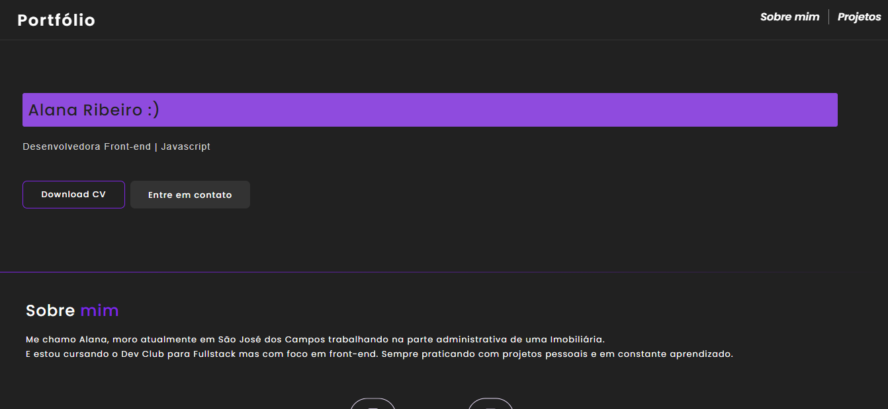
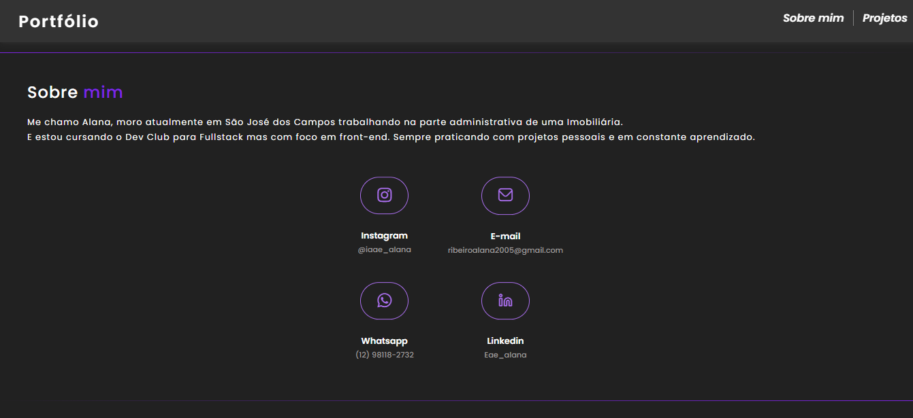
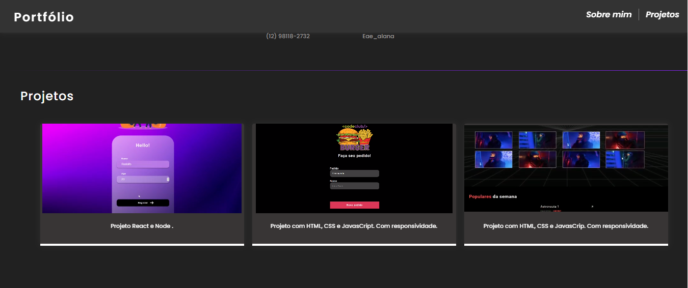

<h1 align="center">Portifólio</h1>

## :memo: Descrição
Link: <a href="https://eaealana.github.io/Portifolio/" target="_blank"> https://eaealana.github.io/Portifolio/ </a>

## :wrench: Tecnologias utilizadas
* HTML
* CSS
* JavaScript

## 💻 Projeto

## :dart: Status do projeto

